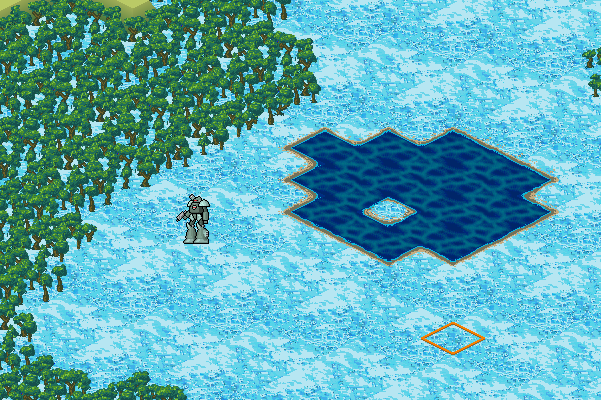

GearHead Caramel
================

GearHead Caramel- Third game in the GearHead series, first written in Python.

To install, just unzip the standalone distribution to a convenient place and
double click "ghcaramel". To do a DIY installation from source code, see the
instructions below.

CONTROLS
========

Most things in GearHead Caramel are done using the mouse, but there
are keyboard shortcuts for some. 
Note that commands are case sensitive- "Q" is different from "q".

Left click: Move to spot

Right click: Open skills menu during exploration

c: Center the screen on the party/active character

Q: Quit the game.

H: Open the Field HQ (Exploration mode only)

m: Browse memos (Exploration mode only)

In the attack/skill/EWar interface, click the name of your weapon/skill/program
to change to a different one. You can scroll through weapons and attack options
using the mouse wheel or the arrow keys.

In the combat movement interface, click the movemode to change movemode.

TROUBLESHOOTING
===============

All of your user files are contained in a folder called "ghcaramel" that
you should be able to find in "My Documents" (on Windows) or your home 
directory (on every other OS). There's a text file there called "config.cfg" 
that contains many options for customizing the game. You can also delete or 
back up your save files from here, if you are the sort of person who would 
do such a thing.

If you have trouble running ghcaramel on MacOS, you may need to set
the executable permission on the file (chmod a+x ghcaramel) or configure
MacOS gatekeeper to allow it to run.

If you get a "permission denied" error on Linux, you may need to set the
executable permission on the file. Right click the ghcaramel file and
open the properties. Make sure "allow this file to run as a program" is
enabled under "Permissions".

If you double click on ghcaramel and instead of running it tries to open
the program file in Mousepad, then congratulations! You are apparently using
XUbuntu which is the same OS I use, but I have no idea why it's doing this
strange thing. You can get around this by running the program from a terminal
or making a shortcut for it on your desktop/app menu.

If the game crashes when you try to open the configuration menu, probably
you have an old config file from a previous installation. Delete config.cfg
from your user directory and reload ghcaramel.

Campaign files prior to v0.900 will not load. You can load the file in a previous
version of the game, enable dev mode, and eject the character by pressing "E" while
in exploration mode. Then go back and turn dev mode off; that mode can mess up your
game in 47,000 different ways. Character files prior to v0.900 should still work.

If you are playing the game on Steam on Linux or a SteamOS device, it's possible that
characters and campaigns started from a different GearHead Caramel install will not load.
Open the config file and turn on dev mode. Then, from the main menu of the non-Steam install, 
select the option "Steam My Eggs". This will convert all of the save files so they'll be
compatible with Steam. Note that it still can't fix campaign files from before v0.900.
After that turn off dev mode, since you don't need that kind of trouble in your life.

If you have a different problem, you can file a bug report at https://github.com/jwvhewitt/gearhead-caramel/issues

BUILDING FROM SOURCE
====================

Things have gotten a bit more complicated since the last time I updated
this file. To build GearHead Caramel from source, first you will need to
install Python3. After that you need to install the PyGame, Numpy, and
Cython packages. The easiest way to install these is with "pip". You may
also need to install a C compiler for Cython; see the Cython page for
details.

  https://cython.org/
  
Before running the program for the first time, you need to build the
caramel-recolor-cython package. Open a terminal in the caramel-recolor-cython
folder and type:

  python setup.py install
  
Depending on your system, you may need to type "python3" instead of "python".
Once this package is installed, you can run main.py to play the game. If you are
getting a "permissions denied" error, or you want to keep things local, use
this command instead:

  python setup.py install --user

Once pbgerecolor has been built + installed you can run the main.py script
directly. There is a cx_Freeze setup.py script in the root folder which may
be used to build + install an executable version of GearHead Caramel; if you
figure that out then more power to you. GearHead Caramel also works with
pyInstaller, and there's a spec script as well.

  python main.py

The first time it's run, the game will create a "ghcaramel" folder in your
home directory (or "My Documents" on Windows) and place a configuration file 
there. This is where all of your  characters and saved games are stored, in 
case you want to delete them or make backups. The configuration file can be 
edited in any text editor.
